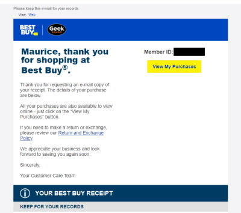

# Transactional Email - Best Buy
This is a recreation of a Receipt from Best Buy. My personal information has been redacted, and will be replaced with fictional info.

# Current Result
Coming Soon..

# Original Email Screenshot
This is the original email. Click the preview see the full image.

---
# Technlogies used
I decided to try an HTML Email Framework called [MJLM](https://mjml.io/). Although easier than Zurb's Foundation for Emails, so far I feel its a lot more limited. I cannot find a way to run any javascript for easier templating, no SASS, and a lot of the sizing problems relate to padding. Its a lot of guess work on that front.
* MJML Framework
* HTML
* CSS

# Important tags
While making this email, I found a few HTML tags worth mentioning
1. `<pre>` - [Source](https://www.w3schools.com/tags/tag_pre.asp) This allowed me to create the receipt style font and styling in the email. The text displays exactly as typed. In other words, any spaces and line breaks you add will be displayed, like a Word doc, or typewriter. No need to add manual tags like ` `.
2. `<wbr>` -[Source](https://developer.mozilla.org/en-US/docs/Web/HTML/Element/wbr) Within the receipt, this tag allows the browser to break a word at time where normally it wouldn't break the word. This is good for long words which, if broken up in a different spot, would be harder to read. In this case, its the validation code which would break in the middle of the entire string, which makes sense.
